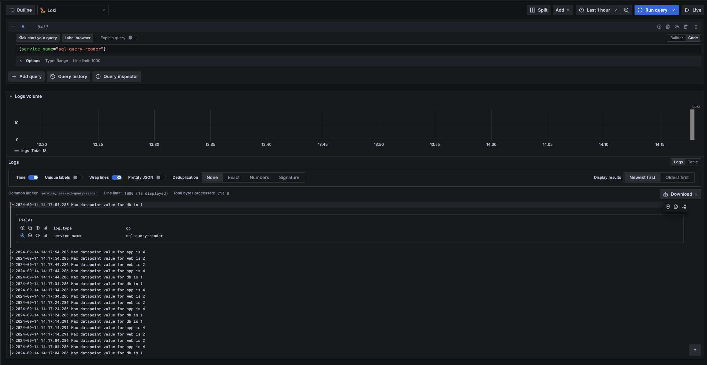
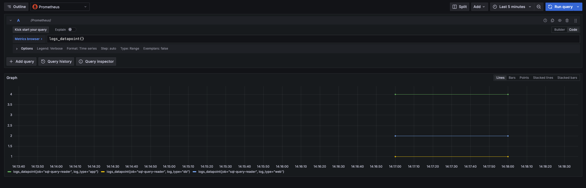

# Custom otel collector with Sql Query Receiver

Testing setup for [sql query receiver component](https://github.com/open-telemetry/opentelemetry-collector-contrib/tree/main/receiver/sqlqueryreceiver)

## Prerequisites:

* docker
* go (version go1.22.6 works)

[OpenTelemetry Collector Builder (ocb)](https://opentelemetry.io/docs/collector/custom-collector/) will be downloaded as
a part of makefile.

**If your architecture is different than MacOS/AMD, you need to
change [download link](https://opentelemetry.io/docs/collector/custom-collector/#step-1---install-the-builder) in the
makefile**

## How to use?

1. Build and start with:

```bash
make run
```

2. Open http://localhost:3000
3. Log in with default credentials (admin/admin)
4. Query logs and metrics from database

### Logs



### Metrics



## What does it do

1. Builds custom otel collector with [provided configuration](./builder-config.yaml)
2. Starts following containers:
    3. postgres with sample data
    4. LGTM stack as observability backend
5. Collector periodically (according to the [configuration](otel-collector-config.yaml)) reads data from the database
   and produces otel signals - logs and metrics 